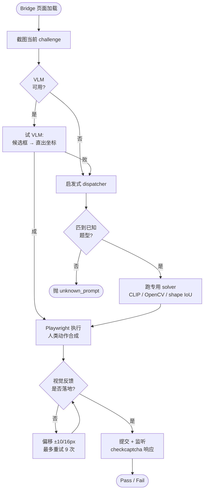

# hCaptcha 视觉求解器

[← 回到 README](../README.md)

`CTF-pay/hcaptcha_auto_solver.py` 是个 4000 行的独立 solver，被 `card.py` 通过 subprocess 拉起（ML 依赖在独立 venv 里，所以不能 import）。它对任何 hCaptcha bridge URL 都通用，不只是 Stripe 这一个场景。

---

## 三层决策



---

## 第 1 层 —— VLM 决策（首选）

调任何兼容 OpenAI 协议的 `/v1/chat/completions` 端点，发 challenge 图、候选区域 overlay、结构化 JSON 指令。两种模式：

### 候选框模式

先用 OpenCV 提候选点击 / 拖拽目标，标号 `G1`、`G2`、`S1`、`T1` 写到 overlay 上，VLM 选 ID。

```json
// 提示给 VLM 的 message 大致这样
{
  "messages": [
    {"role": "system", "content": "你是 hCaptcha 求解器..."},
    {"role": "user", "content": [
      {"type": "text", "text": "Prompt: please click on all the water travel"},
      {"type": "image_url", "image_url": {"url": "data:image/png;base64,..."}},   // 原图
      {"type": "image_url", "image_url": {"url": "data:image/png;base64,..."}},   // 标 ID 后的 overlay
      {"type": "text", "text": "{\"candidates\": [{\"id\": \"G1\", \"bbox\": [...]}, ...]}"}
    ]}
  ]
}
```

VLM 返：

```json
{"action": "click", "selected_ids": ["G1", "G3"]}
{"action": "drag",  "source_id": "S1", "target_id": "T2"}
```

### 直出坐标模式

候选框提取失败时降级，VLM 直接返归一化坐标：

```json
{"action": "click", "coords": [[0.31, 0.42], [0.73, 0.41]]}
{"action": "drag",  "from": [0.2, 0.5], "to": [0.7, 0.5]}
```

### VLM 配置

通过环境变量：

```bash
export CTF_VLM_BASE_URL="https://api.openai.com/v1"
export CTF_VLM_API_KEY="sk-..."
export CTF_VLM_MODEL="gpt-4o"
```

或者命令行 `--vlm-base-url` / `--vlm-api-key` / `--vlm-model` 覆盖。

---

## 第 2 层 —— CLIP / OpenCV 启发式 dispatcher

VLM 不可用或失败时的回退路径。每种已知题型有专用 solver：

| 题型 prompt 关键词 | Solver | 方法 |
|---|---|---|
| `water travel` / `vehicle...water` | `solve_water_travel()` | CLIP 二分类，3×3 grid 或 object 候选 |
| `drag` / `complete the pair` | `solve_pair_drag()` | 颜色聚类定位 source + skeleton 匹配 |
| `missing piece` / `complete the image` | `solve_missing_pieces_drag()` | HSV 槽位检测 + shape IoU |
| `float on water` | `solve_float_on_water()` | CLIP 二分类 |
| `served hot` | `solve_hot_food()` | CLIP 二分类 |
| `hop or jump` / `hopping` | `solve_hop_animals()` | CLIP 滑窗 + 聚类 + 两阶段评分 |
| `produce heat to work` | `solve_heat_work()` | CLIP 二分类 |
| `shiny thing` | `solve_shiny_thing()` | CLIP 二分类（单选） |
| `kept outside` | `solve_kept_outside()` | CLIP 二分类 |
| `dissolve or melt` | `solve_dissolve_melt()` | CLIP 多标签分类 |
| `hidden under the reference object` | `solve_hidden_under_reference()` | 边缘检测 + 连通组件 |
| `complete the road` + `finish line` | `solve_road_completion()` | 边缘检测 + 连通组件 |

---

## 候选区域提取

两种互补策略，根据图像特征自动选择：

### Grid 模式（`detect_label_grid`）

针对标准 3×3 hCaptcha 网格。通过行 / 列像素方差或 non-white 统计检测 3 个等分 band。判定门槛：

- 覆盖率 ≥ 72%
- 均衡度 ≥ 55%

满足两条都过就走 grid 路径。

### Object 模式（`_build_object_candidates_generic`）

非标准布局时回退。用 Canny 边缘 + 连通组件 + 形态学去噪提取独立物体。

---

## 第 3 层 —— Playwright 执行器

### 反检测

注入 `init_script` 覆盖：

```javascript
Object.defineProperty(navigator, 'webdriver', { get: () => undefined });
Object.defineProperty(navigator, 'platform', { get: () => 'Win32' });
Object.defineProperty(navigator, 'hardwareConcurrency', { get: () => 8 });
// + 其他十几个属性
```

### 人类动作合成

- **点击**：4 点 Bézier 曲线逼近 + 随机延迟（200–400ms）
- **拖拽**：3 段插值路径，起 / 中 / 终各加 jitter
- **停顿**：操作间均值 800ms ± 300ms 的 normal distribution

### 视觉反馈重试环

每次交互后抓前后帧，算两个指标：

```python
changed_pixels = np.sum(np.any(frame_after != frame_before, axis=-1))
mean_diff = np.mean(np.abs(frame_after.astype(int) - frame_before.astype(int)))
```

判定 "落地"：`changed_pixels > THRESHOLD_PIXELS` 且 `mean_diff > THRESHOLD_DIFF`。

没落地就**自动偏移重试**：

- 点击：`±10px / ±16px` 八方向 + 原点 = 9 次
- 拖拽：`5 starts × 5 ends = 25` 种 jitter 组合

### 多 raster 源

优先 canvas `toDataURL()` 拿原始位图。canvas 空白（hCaptcha 有时把图绘到 SVG 里）时回退 `body.screenshot()`。

### 网络监听

拦 `hcaptcha.com` 域的两个端点：

```python
page.on("response", lambda r: ...)
# 拦 /getcaptcha → 提取 prompt / ekey
# 拦 /checkcaptcha → 提取 pass 状态
```

提取的元数据写到 `round_XX.json`。

---

## Variation 重试体系

Solver 不返回单一答案，而是**有序候选序列**：

### Click 类

`candidate_click_sets` 按 CLIP 置信度排序：

1. **Strong set**：所有置信度 ≥ 0.5 的 tile
2. **Medium set**：所有置信度 ≥ 0.3 的 tile
3. **逐个单选**：每个候选 tile 单独提交一次

### Drag 类

`build_drag_target_variations()` × `build_drag_start_variations()` 各生成 jitter 变体：

- Source jitter：`±5px / ±10px` 五点
- Target jitter：同上五点
- 总组合：5 × 5 = 25 次

### 图像哈希去重

```python
key = (prompt_text, hashlib.sha1(image_bytes).hexdigest())
exhausted_variations[key].add(variation_id)
```

同题失败的方案自动跳过。

### 耗尽

所有 variation 用完抛：

```python
class drag_variations_exhausted(Exception): pass
class click_set_variations_exhausted(Exception): pass
```

`card.py` 接住后会触发 daemon 的"重跑当前轮"分支。

---

## 单跑 solver

```bash
# 有头模式（看着它干活）
~/.venvs/ctfml/bin/python CTF-pay/hcaptcha_auto_solver.py \
  http://127.0.0.1:PORT/index.html --headed --timeout 300

# 关 VLM，只跑启发式
~/.venvs/ctfml/bin/python CTF-pay/hcaptcha_auto_solver.py \
  http://127.0.0.1:PORT/index.html --no-vlm

# 自定义 VLM
~/.venvs/ctfml/bin/python CTF-pay/hcaptcha_auto_solver.py \
  http://127.0.0.1:PORT/index.html \
  --vlm-base-url https://api.openai.com/v1 \
  --vlm-api-key sk-xxx \
  --vlm-model gpt-4o

# 让 solver 直接提交 verify_challenge
~/.venvs/ctfml/bin/python CTF-pay/hcaptcha_auto_solver.py \
  http://127.0.0.1:PORT/index.html \
  --verify-url      "https://api.stripe.com/v1/setup_intents/.../verify_challenge" \
  --verify-client-secret "seti_xxx_secret_xxx" \
  --verify-key      "pk_live_xxx"
```

---

## 调试产物

`--out-dir`（默认 `/tmp/hcaptcha_auto_solver`）：

| 文件 | 含义 |
|---|---|
| `round_XX.png` | 每轮截图 |
| `round_XX.json` | 每轮完整决策元数据（prompt、候选框、VLM 响应、最终决策、视觉反馈值） |
| `checkcaptcha_pass_*.json` | 过的那次的网络监听快照 |
| `checkcaptcha_fail_*.json` | 失败那次的快照 |
| `session_meta_*.json` | 整个会话元信息 |

调试一道失败的题：

```bash
# 找最近一次失败
ls -lt /tmp/hcaptcha_auto_solver_live/checkcaptcha_fail_*.json | head -1

# 看决策过程
cat /tmp/hcaptcha_auto_solver_live/round_05.json | jq .
```

---

## `card.py` 集成方式

`card.py` 通过 `subprocess` 调 solver，传 bridge URL 和 VLM 配置：

```json
"browser_challenge": {
  "external_solver": {
    "enabled": true,
    "python": "~/.venvs/ctfml/bin/python",
    "script": "hcaptcha_auto_solver.py",
    "out_dir": "/tmp/hcaptcha_auto_solver_live",
    "timeout_s": 180,
    "headed": false,
    "vlm": {
      "enabled": true,
      "model": "gpt-4o",
      "base_url": "https://api.openai.com/v1",
      "api_key": "",
      "timeout_s": 45
    }
  }
}
```

`card.py::solve_stripe_hcaptcha_in_browser()` 检测到需要非 invisible challenge 且没显式配 external_solver 时会自动补齐上面这段。

solver 结果通过本地 bridge HTTP endpoint `/result` 回传给 `card.py`。

---

## 扩展新题型

三步：

1. 写匹配函数：

```python
def is_carry_things_prompt(prompt: str) -> bool:
    p = prompt.lower()
    return "carry" in p and "things" in p
```

2. 写求解函数：

```python
def solve_carry_things(image: np.ndarray, prompt: str, **kw) -> SolverResult:
    # ... CLIP / OpenCV / 你的方法
    return SolverResult(
        action="click",
        candidate_click_sets=[
            [tile_idx_1, tile_idx_2],   # strong set
            [tile_idx_1],                # fallback set
        ],
        ...
    )
```

3. 在 `solve_bridge()` 的 dispatcher 加分支：

```python
elif is_carry_things_prompt(prompt):
    result = solve_carry_things(image, prompt, ...)
```

PR 欢迎，看 [CONTRIBUTING.md](../CONTRIBUTING.md)。

---

## 已知题型覆盖范围

当前覆盖约 12 种常见 hCaptcha 题型（看上面表格）。遇到没见过的 prompt 时：

- VLM 启用：仍尝试 VLM 直出坐标 / 候选框决策
- VLM 失败：抛 `unknown_prompt` 错误
- 调试信息保存到 `out_dir` 供后续分析

每加一种新题型大概需要：

- 100–500 张该题型截图（用过去 daemon 跑出来的 `round_XX.png` 攒）
- 读 prompt 文本找模式
- 写匹配函数 + solver
- 集成测试

---

## 性能调优建议

| 场景 | 建议 |
|---|---|
| **VLM 慢** | 调小 `vlm.timeout_s`，提前降级到启发式 |
| **VLM 不准** | 换更强的模型（`gpt-4o` → `claude-opus-4-7`），或者改 system prompt |
| **CLIP 慢** | 用 GPU venv（`pip install torch --index-url https://download.pytorch.org/whl/cu121`） |
| **重试太多** | 调小 `max_click_retries` / `max_drag_retries`，让 daemon 重跑而不是 solver 内 retry |
| **题型未覆盖** | 加新 solver（看上面） |
